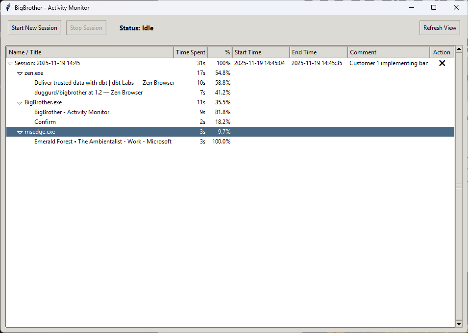
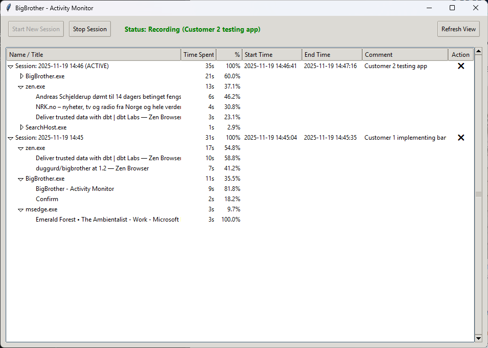

# BigBrother - Activity Tracking & Session Monitoring

<p align="center">
  
</p>

Track your computer activity with detailed window focus and title change monitoring. Perfect for consultancy work tracking, productivity analysis, and time billing.

## 📸 Screenshots

### Dashboard / Historical View
View past sessions, drill down into applications, and see detailed time breakdowns.


### Active Session Recording
While recording, the active session is highlighted, and the status bar shows your current goal.


---

## 🚀 Installation (Recommended)

For most users, simply download and install the application:

1. **Download** the latest installer (`BigBrother_Setup.exe`) from the releases page (or `scripts/Output` if building locally).
2. **Run** the installer.
3. Launch **BigBrother** from your **Start Menu** or **Desktop**.

---

## 🛠️ Development & Building

If you want to modify the code or build it yourself:

### Prerequisites
- **Windows** 10/11
- **Python 3.12+**
- **uv** (Dependency Manager) - *will be auto-installed if missing*

### 1. Run from Source
1. Clone the repo:
   ```bash
   git clone https://github.com/yourusername/bigbrother.git
   cd bigbrother
   ```
2. Install dependencies and run:
   ```bash
   uv sync
   uv run python src/python/main.py
   ```

### 2. Build Windows Installer
To create the `BigBrother_Setup.exe` installer yourself:

1. Install [Inno Setup 6](https://jrsoftware.org/isdl.php).
2. Run the build script:
   ```bash
   build_installer.bat
   ```
3. The installer will be created at: `scripts/Output/BigBrother_Setup.exe`

*(Note: `build_installer.bat` automatically handles Python dependencies, builds the standalone EXE, and then compiles the Setup Wizard.)*

---

## 📁 Project Structure

```
bigbrother/
├── src/
│   ├── python/          # Main Python application source
│   │   └── main.py      # Unified Monitor & Viewer logic
├── dist/                # Built executable (temporary)
├── scripts/
│   ├── installer.iss    # Inno Setup configuration
│   └── Output/          # Final Installer location
├── media/               # Screenshots and assets
├── pyproject.toml       # Python dependencies & config
├── build_exe.bat        # Script to build standalone EXE
├── build_installer.bat  # Script to build Setup Wizard
└── README.md            # Documentation
```

## 🔧 Features

### Unified Monitor & Viewer
- **Control Panel**: Start/Stop sessions with goal descriptions.
- **Live Monitoring**: Tracks window focus and title changes in the background.
- **Timeline View**: Visual tree of sessions -> applications -> windows.
- **Time Tracking**: Precise duration and percentage breakdown.
- **Data Persistence**: Automatically saves to `%APPDATA%\BigBrother\focus_log.json`.

## 📊 Data Format

Sessions are saved to: `%APPDATA%\BigBrother\focus_log.json`

```json
{
  "sessions": [
    {
      "start_timestamp": 1727712000,
      "end_timestamp": 1727715600,
      "comment": "Working on Project X",
      "applications": [
        {
          "process_name": "Code.exe",
          "process_path": "C:\\Program Files\\Microsoft VS Code\\Code.exe",
          "total_time_spent_ms": 3600000,
          "tabs": [
            {
              "window_title": "main.py - Visual Studio Code",
              "total_time_spent_ms": 3600000
            }
          ]
        }
      ]
    }
  ]
}
```

## 🎯 Use Cases

- **Consultancy Billing** - Track time per client/project
- **Productivity Analysis** - See where time actually goes
- **Work Documentation** - Generate activity summaries
- **Time Tracking** - Detailed work session records

## 📝 License

MIT License - See LICENSE file for details

---

**Note:** This is a Windows-only application due to its reliance on Windows-specific APIs.
